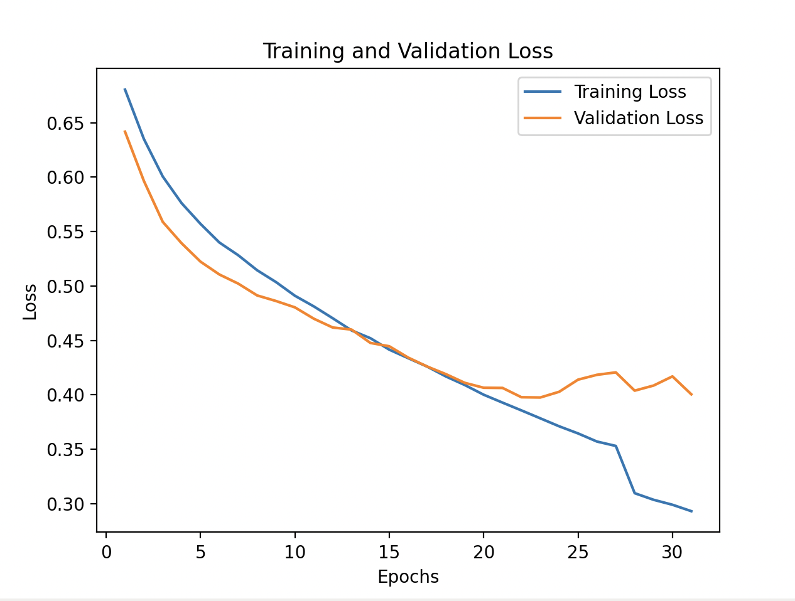

# Introduction to machine learning projects

This repository consists of four projects that were part of the Introduction to Machine Learning lecture given by Prof. Dr. Andreas Krause and Prof. Dr. Fan Yang at ETH Zurich in spring semester 2023.
These projects counted for 30% of the final grade of the course, and the remaining 70% was a final written exam. Full details of the course can be found on the official [webpage](https://las.inf.ethz.ch/teaching/introml-s23).

The projects were done in groups of up to 3 students, and the entire code in this repository was written by our group consisting of [Benjamin Dupont](https://github.com/ben-du-pont) and [Mateo Hamel](https://github.com/hamelmateo). The code was written in Python and used libraries such as numpy, pandas, scikit-learn, and pytorch, sometimes using a base template provided by the course staff.

## Summary of Projects

1. [Project 1: Linear Regression](#project-1-linear-regression)
    - Implemented cross-validation for ridge regression and explored feature transformations to improve model performance.

2. [Project 2: Prediction of electricity price in Switzerland](#project-2-prediction-of-electricity-price-in-switzerland)
    - Developed a model to predict electricity prices in Switzerland using data from other countries at various seasons of the year. Implemented an imputer to fill in the missing data and a gaussian process regressor to predict the price on a test set.

3. [Project 3: Classification of food preferences](#project-3-classification-of-food-preferences)
    - Created a classification model to determine food preferences based on image triplets. The project involved extracting embeddings from a pre-trained model and training a custom classifier neural network to determine for each image triplet (A, B, C) if A was closer to B or to C.

4. [Project 4: Predicting HOMO-LUMO Gaps for Solar Cell Material Discovery](#project-4-predicting-homo-lumo-gaps-for-solar-cell-material-discovery)
    - Developed a pipeline combining transfer learning and an autoencoder-based feature extraction to predict HOMO-LUMO gaps for solar cell materials. Leveraged a large pretraining dataset for embedding generation and fine-tuned a Ridge regression model on a limited labeled dataset for accurate predictions.


## Project 1: Linear Regression
This first project was an introduction to linear regression and ridge regression and was subdivided into two tasks:

### 1a - Cross validation for ridge regression

Implemented K-fold cross-validation with 10 folds to evaluate the performance of ridge regression for 5 different values of lambda. The RMSE was calculated for each lambda and averaged over the folds to determine the optimal regularization parameter. The process involved splitting the data into training and validation sets, fitting the model on the training set, and evaluating it on the validation set. The results were used to select the best lambda value that minimized the average RMSE.

### Training Data Format

The training data is provided in a CSV format with the following columns:

```
y, x1, x2, x3, x4, x5, x6, x7, x8, x9, x10, x11, x12, x13
```

- `y`: Target variable
- `x1, x2, ..., x13`: Feature variables

Exact implementation and datasets can be found in the [`task1a`](./task1a) folder.


### 1b - Ridge regression with transformed features
The goal was to transform the original features from the data and then use ridge regression to predict the target variable by finding the optimal weights of the regression model on these transformed features. Specifically, the transformation of the 5 input features of matrix $X$ (where $x_i$ denotes the $i$-th component of $X$) into 21 new features $\phi(X)$ was done as follows:

1. **Linear Features**:
    - $\phi_1(X) = x_1$
    - $\phi_2(X) = x_2$
    - $\phi_3(X) = x_3$
    - $\phi_4(X) = x_4$
    - $\phi_5(X) = x_5$

2. **Quadratic Features**:
    - $\phi_6(X) = x_1^2$
    - $\phi_7(X) = x_2^2$
    - $\phi_8(X) = x_3^2$
    - $\phi_9(X) = x_4^2$
    - $\phi_{10}(X) = x_5^2$

3. **Exponential Features**:
    - $\phi_{11}(X) = \exp(x_1)$
    - $\phi_{12}(X) = \exp(x_2)$
    - $\phi_{13}(X) = \exp(x_3)$
    - $\phi_{14}(X) = \exp(x_4)$
    - $\phi_{15}(X) = \exp(x_5)$

4. **Cosine Features**:
    - $\phi_{16}(X) = \cos(x_1)$
    - $\phi_{17}(X) = \cos(x_2)$
    - $\phi_{18}(X) = \cos(x_3)$
    - $\phi_{19}(X) = \cos(x_4)$
    - $\phi_{20}(X) = \cos(x_5)$

5. **Constant Feature**:
    - $\phi_{21}(X) = 1$

The ridge regression model was then trained on these transformed features to predict the target variable $y$.

The implementation involved the following steps:

1. **Feature Transformation**: The original features were transformed as described above to create a new feature matrix $\Phi$.
2. **Model Training**: Ridge regression was applied to the transformed features. The model was trained using the training data provided.
3. **Cross-Validation**: Cross-validation was performed to select the optimal regularization parameter lambda. The RMSE was calculated for each lambda and averaged over the folds to determine the optimal regularization parameter and therefore the best model.

The code for this task can be found in the [`task1b`](./task1b) folder. The training data is provided in a CSV format with the following columns:

```
Id, y, x1, x2, x3, x4, x5
```

- `Id`: Identifier for each data point
- `y`: Target variable
- `x1, x2, ..., x5`: Feature variables


## Project 2: Prediction of electricity price in Switzerland
This project involved predicting the electricity price in Switzerland using data from other countries. The dataset included electricity prices from various countries across different seasons, with some missing values. The implementation steps were as follows:

1. **Data Imputation**: Missing values in the dataset were imputed using statistical methods to ensure a complete dataset for model training.
2. **Model Training**: A Gaussian Process Regressor with a RationalQuadratic kernel was trained on the imputed dataset to predict the electricity prices in Switzerland.
3. **Evaluation**: The model was evaluated on the test set, and the predictions were saved in a results file.

The code for this project can be found in the [`task2`](./task2) folder. The training data is provided in a CSV format with the following columns:

| Column       | Description                        |
|--------------|------------------------------------|
| `season`     | Season of the year                 |
| `price_AUS`  | Electricity price in Australia     |
| `price_CHF`  | Electricity price in Switzerland (to be predicted in the test set)  |
| `price_CZE`  | Electricity price in Czech Republic|
| `price_GER`  | Electricity price in Germany       |
| `price_ESP`  | Electricity price in Spain         |
| `price_FRA`  | Electricity price in France        |
| `price_UK`   | Electricity price in the United Kingdom |
| `price_ITA`  | Electricity price in Italy         |
| `price_POL`  | Electricity price in Poland        |
| `price_SVK`  | Electricity price in Slovakia      |


## Project 3: Classification of food preferences

This project aimed to classify food preferences based on image triplets. The task was to determine which of two images (B or C) is more similar to a reference image (A). The dataset consisted of images of food items, and the training data was provided in the form of triplets, where it was always true that image A was closer to image B than to image C.

### Data Format

The data was organized in the following structure:
- **Dataset Folder**: `/food`
- **Training Triplets**: Provided in a CSV file with columns `A`, `B`, and `C`, representing the file paths of the images in each triplet.


### Goal

The goal was to train a model that could predict, for each triplet in the test set, whether image A is closer to image B than to image C. The predictions were binary, with `1` indicating that A is closer to B, and `0` indicating that A is closer to C.

### Implementation

The implementation involved the following steps:

1. **Data Preprocessing**: 
    - Loaded the images from the dataset folder.
    - Resized and normalized the images to ensure consistency in input dimensions.

2. **Feature Extraction**:
    - Used a pre-trained convolutional neural network (CNN) to extract embeddings from the images. The embeddings captured the high-level features of the images.

3. **Model Training**:
    - Constructed a custom neural network classifier that took the embeddings of the triplets as input.
    - The network was trained to minimize a loss function that encouraged the model to correctly predict the similarity relationship in the training triplets.

4. **Evaluation**:
    - Evaluated the model on the test set by predicting the similarity relationship for each triplet.
    - Annotated the test triplets with `1` (true) or `0` (false) based on the model's predictions.

The code for this project can be found in the [`task3`](./task3) folder. The main implementation details are in the `main.py` file, which includes the data loading, model definition, training loop, and evaluation logic.

The training data is provided in a CSV format with the following columns:

| Column | Description                  |
|--------|------------------------------|
| `A`    | Number/File path of the reference image |
| `B`    | Number/File path of the first comparison image |
| `C`    | Number/File path of the second comparison image |

The training data label is assumed to be `1` for all triplets, indicating that image A is closer to image B than to image C.

The test data follows the same format, and the goal is to predict whether image A is closer to image B than to image C for each triplet.



## Project 4: Predicting HOMO-LUMO Gaps for Solar Cell Material Discovery

### Overview

This project aims to identify materials suitable for solar cell manufacturing by predicting a molecule's HOMO-LUMO gap, a key feature that determines its usefulness in such applications. Directly testing for the HOMO-LUMO gap through computational chemistry simulations is time-consuming and computationally expensive. Instead, this project leverages machine learning to predict the HOMO-LUMO gap based on molecular structure.

The challenge lies in the limited availability of labeled data: the dataset contains only 100 examples of molecules with their corresponding HOMO-LUMO gap. However, a separate pretraining dataset with 50,000 molecule-energy pairs (with LUMO energy values but not the HOMO-LUMO gap) is available. To address this, a transfer learning approach is employed using an autoencoder strategy.

---

### Problem Statement

Predicting the HOMO-LUMO gap of molecules is a computationally intensive task. The gap determines a material's suitability for solar cell applications. Given:

- **Pretraining data:** 50,000 molecule-to-HOMO/LUMO energy pairs (unlabeled for HOMO-LUMO gaps).
- **Training data:** Only 100 molecule-to-HOMO-LUMO gap pairs (labeled).
- **Test data:** 10,000 molecules for which the HOMO-LUMO gap needs to be predicted.

The challenge lies in utilizing the pretraining dataset to improve predictions on the downstream task of HOMO-LUMO gap prediction.

---

### Approach

To solve this problem, we employed a two-step pipeline combining transfer learning and regression:

#### 1. **Pretraining: Feature Extraction**
We use a feedforward neural network (MLP) with the following architecture:
- **Input layer:** Matches the feature size of the input molecules.
- **Hidden layers:** 
  - Layer 1: 256 neurons, ReLU activation.
  - Layer 2: 64 neurons, ReLU activation (penultimate layer).
- **Output layer:** 1 neuron (to predict energy values in the pretraining task).

The **penultimate layer (64 features)** is used as the reduced feature representation for the downstream task.

**Training Details:**
- Loss Function: Mean Squared Error (MSE).
- Optimizer: Adam with a learning rate of 0.001.
- Batch Size: 200.
- Validation: 10% of the pretraining dataset is used for validation.
- Stopping Criteria: Early stopping based on validation loss.

#### 2. **Downstream Task: Ridge Regression**
Once the features are extracted using the pretrained model, we:
1. Normalize the features using `StandardScaler` from `sklearn`.
2. Train a Ridge regression model on the training dataset with the extracted 64 features.
3. Hyperparameter tuning: Ridge regression's `alpha` parameter is optimized using cross-validation over a predefined range ([0.1, 1.0, 10.0]).

The test dataset is processed using the same pipeline, and predictions are made using the trained Ridge regression model.

---

### Results

The final output of the pipeline is saved as a CSV file (`task4/results.csv`), containing the predicted HOMO-LUMO gaps for the test molecules.

---

### Files and Structure

- **Code:** 
  - `main.py`: Contains the complete implementation of the pretraining and regression pipeline.
  - `MLPRegressor`: Custom class defining the feedforward neural network.
  - `pretrain_model`: Function for training the neural network on the pretraining dataset.
  - Ridge regression and feature normalization implemented using `sklearn`.

- **Data:**
  - `pretrain_features.csv.zip`: Features for pretraining.
  - `pretrain_labels.csv.zip`: Labels (energies) for pretraining.
  - `train_features.csv.zip`: Features for training.
  - `train_labels.csv.zip`: Labels (HOMO-LUMO gaps) for training.
  - `test_features.csv.zip`: Features for testing.

- **Output:**
  - `results.csv`: Predictions for the test molecules.

---

### Key Advantages

- **Transfer Learning:** Efficiently utilizes the large pretraining dataset to learn meaningful features, reducing the dependency on a large labeled training dataset.
- **Feature Extraction:** The penultimate layer (64 features) provides a compact, meaningful representation of molecular data for downstream tasks.

---

